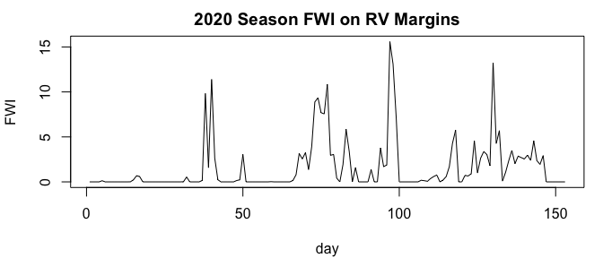
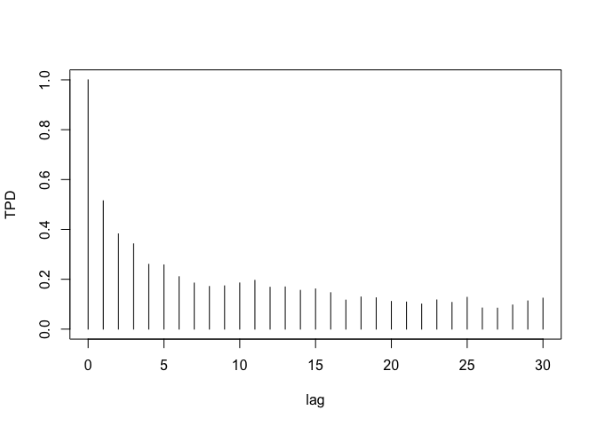
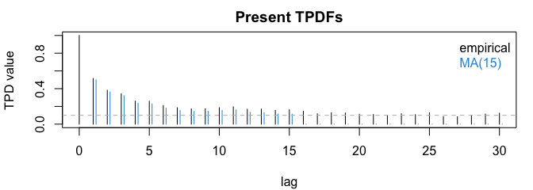
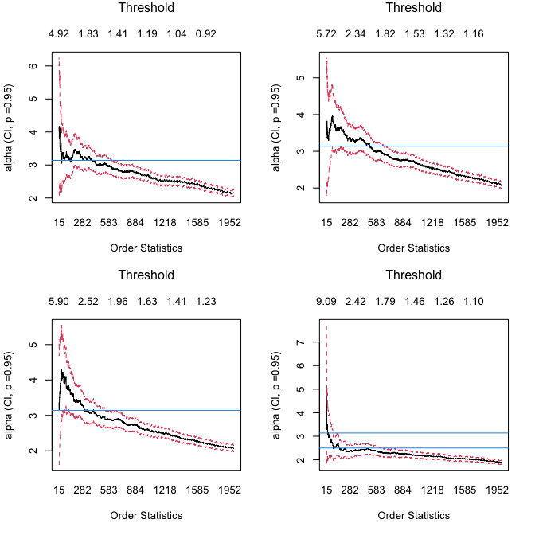
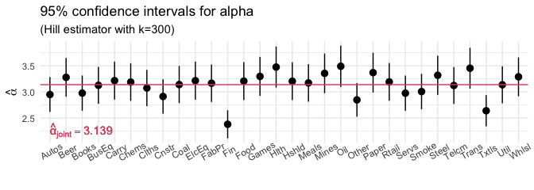
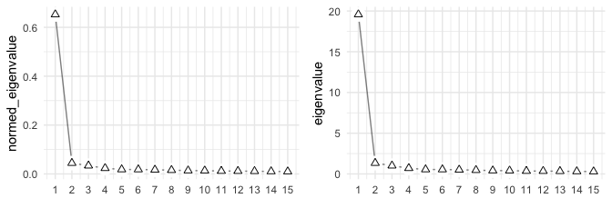
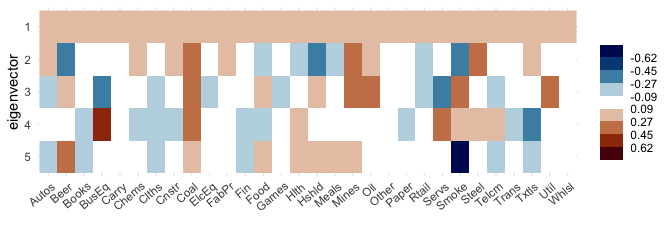
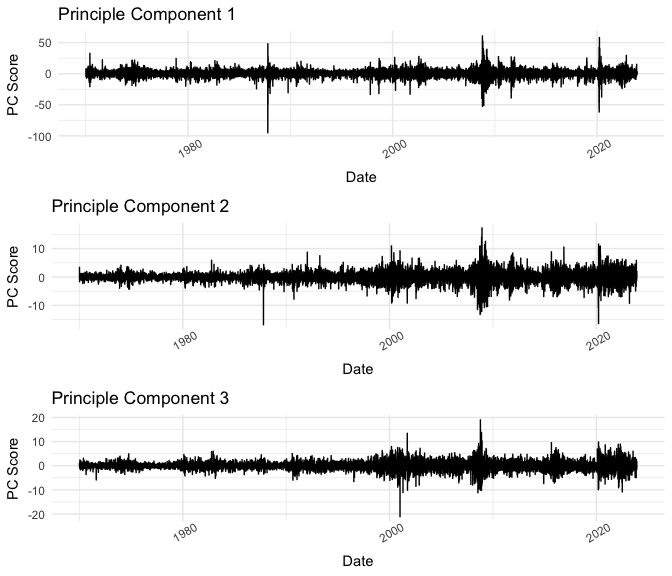
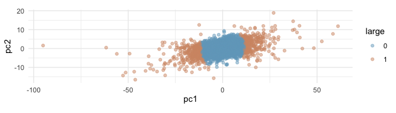
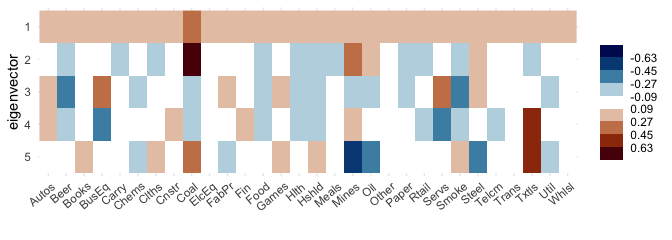

<!-- README.md is generated from README.Rmd. Please edit that file -->

# tpdmethods

<!-- badges: start -->

<!-- badges: end -->

The goal of tpdmethods is to make TPD-based methods accessible to more
researchers.

Recent work in multivariate extremes is built on the so-called tail
pairwise dependence (TPD). This summary metric of dependence in the
pairwise tail shares properties with covariance and this recent work has
used these properties to construct extremal analogues to classical
statistical tools including PCA and ARMA time series models. We
implement these extremal analysis pipelines in this R package
‘tpdmethods’. The package includes datasets and vignettes for
precipitation and fire weather analyses.

## Installation

You can install the development version of tpdmethods from
[GitHub](https://github.com/) with:

``` r
# install.packages("pak") # pak is a method to download packages from a variety of sources.
pak::pak("twixson/tpdmethods")
```

%

%

%

%

%

## Example 1: Time Series - Fire Weather

In this example we show a simple transformed-linear extremes time series
(TLETS) workflow. We will perform a simplified version of the analysis
in Wixson and Cooley (2023). The scientific question is how much more
likely is a fire season like 2020 under present climate than under past
climate. Wixson and Cooley (2023) used Fire Weather Index (FWI) data to
answer this question. An example script and the original data can be
found at
<https://github.com/twixson/seasonal_wildfire_risk_attribution>. The
data exhibited seasonality and so the authors performed a marginal
transformation that made the assumption of tail stationarity plausible
and put the FWI data on regularly varying ($\alpha = 2$) margins. This
marginally-transformed data lives in the package as
`fire_weather_present`, and `fire_weather_past`. Each dataset is a
matrix with 153 rows for the days in the fire season and 20 columns for
the years.

``` r
library(tpdmethods)
par(mar = c(4, 4, 2, 1) + 0.1)
plot(fire_weather_present[,15], 
     type = "l",
     main = "2020 Season FWI on RV Margins", 
     xlab = "day", 
     ylab = "FWI")
```



### Tail Pairwise Dependence Function

The first step is to estimate the tail pairwise dependence function
(TPDF) of the time series data. Since these data have plausibly iid
replicates (each season) and are already on Fréchet($2$) margins we will
use `matrix_as_seasons = TRUE`, `trans_marginal = FALSE`, and
`fix_alpha = 2` in our `tpd()` call. We note that `max_lag` matters
because we are performing a time series analysis but other uses of the
package will ignore this.

``` r
fw_tpd_present <- tpd(fire_weather_present, 
                      max_lag = 30, 
                      trans_marginal = FALSE, 
                      matrix_as_seasons = TRUE, 
                      fix_alpha = 2)
#> [1] "Assuming this is a time series with 20 seasons."

plot(0:30, fw_tpd_present, 
     type = "h", 
     ylim = c(0, 1), 
     xlab = "lag", 
     ylab = "TPD")
```



### Model Fitting

After estimating the TPD we need to fit a model to the data. We will use
the extremes analogue to the innovations algorithm (Mhatre and Cooley,
2023) to fit a transformed-linear moving average (TL-MA) model up to
order `q = 20`. This function automatically checks if the inputted `tpd`
object was generated assuming an alpha of 2. This is necessary because
the development of the algorithm assumes $\alpha = 2$.

We assess model fit by visually comparing the plot of the fitted TPD
function to the empirical TPD function.

``` r
set.seed(1982374)
model_coefs_present <- innovations(fw_tpd_present, max_q = 20)
fitted_model_tpdf <- maq_tpdf(model_coefs_present$coefs[15,], max_lag = 30)

par(mar = c(4, 4, 2, 1) + 0.1)
plot(0:30, fw_tpd_present, type = "h", ylim = c(0, 1), 
     main = "Present TPDFs", 
     xlab = "lag", 
     ylab = "TPD value")
lines(1:30 + 0.2, fitted_model_tpdf, 
      type = "h", col = "4")
legend("topright", legend = c("empirical", "MA(15)"), 
       text.col = c(1,4), bty = "n")
abline(h = 0.1, lty = 2, col = "grey")
```



Here we can see the TL-MA(15) model fits well up to lag-15. TL-MA(q)
models have non-zero TPDFs only up to lag-q just like classical MA(q)
models. Included on the plot is a horizontal dashed line at 0.1. This is
included because of the known bias in the TPD estimator. Wixson and
Cooley (2023) considered TPD values that were consistently around this
line to be the known bias and thus continued their analysis with the
TL-MA(15).

We could repeat the previous steps with the past-climate data (from
1958-1979) but will skip that for brevity.

In addition to these TPDF plots we will take a look at a summary
statistic to assess fit. We will consider the number of $k$-day runs
above a high  
quantile. In particular, we want to know the expected number of $k$-day
runs above the high quantile in a season.

``` r
q099 <- stats::quantile(fire_weather_present, probs = 0.99)

above_present <- apply(fire_weather_present, 2, function(x){
  above <- which(x > q099)
  run_lengths <- rle(diff(above))$lengths[rle(diff(above))$values == 1] + 1
  return_val <- c(sum(run_lengths >= 2),
                  sum(run_lengths >= 3), 
                  sum(run_lengths >= 5),
                  sum(run_lengths > 9))
})

rownames(above_present) <- c("2-day", "3-day", "5-day", "10-day")
present_confints <- apply(above_present, 1, function(x){
  count <- sum(x)
  out <- poisson.test(count, 20)
  return(c(out$estimate, out$conf.int))
})
rownames(present_confints) <- c("mean", "lower", "upper")
round(present_confints, 4)
#>        2-day  3-day  5-day 10-day
#> mean  0.3000 0.0500 0.0000 0.0000
#> lower 0.1101 0.0013 0.0000 0.0000
#> upper 0.6530 0.2786 0.1844 0.1844
```

We generate the confidence intervals using a Poisson distribution with
the primary goal of comparing to the intervals created this way from our
generated seasons.

Below we will generate 1000 seasons from the fitted model using
`gen_maq()`. Note that the marginal distribution is unknown so we
transform to Fréchet($2$) margins with `transform_marginal()` so that we
can compare to the observed RV FWI data.

``` r
set.seed(2389098)
temp_present <- gen_maq(n = 153*1000, 
                        thetas = model_coefs_present$coefs[15,1:15]) 
seasons_present <- 
  matrix(transform_marginal(temp_present, fix_gpd_params = TRUE, gpd_shape = 0.5), 
         ncol = 1000)
# bias correction to match pre-processed FWI data on RV margins. 
seasons_present <- seasons_present - mean(seasons_present)
seasons_present <- ifelse(seasons_present < 0, 0, temp_present)
```

Now that we have generated 1000 seasons lets repeat the above exercise
and estimate expected number of runs of length $k$ in a season:

``` r
above_generated <- apply(seasons_present, 2, function(x){
  above <- which(x > q099)
  run_lengths <- rle(diff(above))$lengths[rle(diff(above))$values == 1] + 1
  return_val <- c(sum(run_lengths >= 2),
                  sum(run_lengths >= 3), 
                  sum(run_lengths >= 5),
                  sum(run_lengths > 9))
})
rownames(above_generated) <- c("2-day", "3-day", "5-day", "10-day")
generated_confints <- apply(above_generated, 1, function(x){
  count <- sum(x)
  out <- poisson.test(count, 1000)
  return(c(out$estimate, out$conf.int))
})
rownames(generated_confints) <- c("mean", "lower", "upper")
round(generated_confints, 4)
#>        2-day  3-day  5-day 10-day
#> mean  0.3630 0.1420 0.0520 0.0110
#> lower 0.3266 0.1196 0.0388 0.0055
#> upper 0.4023 0.1674 0.0682 0.0197
```

We note broad agreement between our data and the fitted model.

### Summary

This brief example demonstrated a few of the key functions:

- `tpd()` - for estimating the TPD function with replicated time series.
- `innovations()` - for fitting any order TL-MA(q) model based on the
  estimated TPD function.
- `maq_tpdf()` - for computing the model TPD function.
- `gen_maq()` - for generating observations from a TL-MA(q) process.
- `transform_marginal()` - for transforming the marginal distribution to
  be Fréchet($\alpha = 2$).

%

%

%

%

%

## Example 2: Principal Components Analysis - Financial Data

In this second example we will explore the extremes analogue to
principal components analysis using financial data from the Kenneth R.
French Data Library. These data are included in the package as
`financial_data`. The data consist of 13599 observations of losses
(negative value-averaged daily returns) from 30 financial sectors (e.g.,
coal, autos, and retail) from 1970 through 2023. Definitions of the
financial sectors can be found in `Industry_definitions.txt`.

### Data Exploration

The first step of the analysis pipeline is to determine whether the data
are heavy tailed, if they can be reasonably assumed to have the same
index of regular variation (alpha), and to estimate that alpha. This is
required because the `tpd()` function assumes a heavy tail and a shared
alpha.

To check the tail of these data we will use the Hill estimator (Hill,
1975). This estimator uses the largest `k` order statistics to estimate
alpha. A standard way of choosing `k` is to look at a Hill plot which
computes the Hill estimator across a range of values for `k`. Using the
Hill plot we choose the largest `k` such that the estimates for all
smaller values of `k` are relatively stable. We use the function
`hill()` from the `evir` package on a few sectors here to illustrate the
method. We consider using up to `k = 2000` (the 0.85 quantile) as a
larger `k` seems implausible. In addition we and add horizontal lines to
the Hill plots as a visual aid. The first three plots include a line at
the joint estimate and the last plot includes a second line at a more
believable value for that financial sector.

``` r
par(mfrow = c(2,2))
  evir::hill(financial_data[,2], end = 2000)
  abline(h = 3.139, col = 4)
  evir::hill(financial_data[,3], end = 2000)
  abline(h = 3.139, col = 4)
  evir::hill(financial_data[,29], end = 2000)
  abline(h = 3.139, col = 4)
  evir::hill(financial_data[,30], end = 2000)
  abline(h = c(2.5, 3.139), col = 4)
```



``` r
par(mfrow = c(1,1))
```

Most of the plots for the 30 financial sectors look similar to the two
plots in the top row. The plot in the bottom left is hard to interpret
as the estimates do not appear to stabilize. The plot on the bottom
right complicates the inference as the estimates appear to stabilize but
at a different value for alpha. In all four plots the estimates for
alpha become noisy when `k` is quite small which is expected as the
variance is greater when there are fewer observations used.

While selecting a single value above which the estimates become stable
is challenging, the horizontal line in these plots suggests that using
somewhere between 300 and 500 order statistics is reasonable. We will
move forward with `k = 300` because of the Hill plot on the bottom left
which suggests a smaller number is needed. Selecting `k = 300`
corresponds to assuming stability above the 0.98 quantile which is high
enough be be reasonable. We assume that the same `k` is reasonable for
all variables. This will not always be the case (for example weather
station data with different length records would likely use different
`k`’s). This package cannot handle differing `k`’s.

Our next step is to determine if it is plausible that the shape of the
tail for all of the variables is the same (i.e., if they share an
alpha). To do this we use the `alpha_plot()` function which plots the
point estimate and confidence interval for each variable as well as a
horizontal line at the joint estimate.

``` r
alpha_plot(financial_data[,-1], k = 300)
#> Warning in is.na(x): is.na() applied to non-(list or vector) of type 'language'
```



There is broad agreement across financial sectors with two notable
exceptions. The financial and textiles sectors appear to have smaller
alphas (heavier tails) than the rest of the market. Here the researcher
has to make a choice about whether a common alpha makes sense or not.
There are multiple testing issues involved with comparing 30 confidence
intervals and that the choice of `k` has a large effect on the resulting
confidence intervals.

From here a practitioner needs to determine if they want to transform
the margins. If the practitioner wants to transform the margins (as we
do in the first of our two following analyses) then the assumption of a
common alpha is unnecessary as the marginal transformation will put all
variables on Fréchet($\alpha = 2$) margins. The practitioner can move
forward with the marginal transformation whether or not the underlying
variables have the same alpha. If, instead, the practitioner wants to
leave the variables on the natural margins then they must be willing to
assume a common alpha (as we do in the second of the following
analyses). If the assumption of a common alpha is reasonable for some,
but not all, of the desired variables then the practitioner could drop
variables with different tails from the study or transform the margins
of the few that don’t match.

### PCA Example 1: Correlation Analogue

Transforming the margins can be done to ensure a shared alpha. The
method of transforming the margins that is built into the `tpdmethods`
package assumes that a generalized Pareto distribution is a reasonable
model above some high quantile (the emperical 0.975-quantile by default)
and uses a rank transformation (the ECDF) below that quantile. This
piece-wise model is used to put each variable onto uniform margins which
are then transformed with the probability integral transform to
Fréchet($\alpha = 2$) margins. This transformation, coded in the
`transform_marginal()` function, ensures a common alpha as well as a
common scale. Since the variables now each have unit scale the
subsequent analysis is analogous to PCA on the correlation matrix rather
than the covariance matrix.

To move forward with our analysis we must estimate the TPD matrix
(TPDM). The TPDM is an extremes analogue to the covariance matrix. It
shares many properties with a covariance matrix including having a
correlation analogue as a special case. The `tpd()` function is used to
estimate the TPDM and it includes the marginal transformation by default
(`trans_marginal = TRUE`). Here we have to exclude the first column as
it is the dates of each observation.

``` r
tpdm <- tpd(as.matrix(financial_data[,-1]))
#> [1] "Matrix input, we assume rows represent replicates"
#> [1] ". . . and columns represent variables."
```

Now that the TPDM is estimated we perform an eigen decomposition just
like in classical PCA. The elements of the TPDM are estimated pairwise
and thus the estimated TPDM may not be positive definite. We fix this by
performing the eigen decomposition on a positive definite matrix that is
close to the estimated TPDM using the `make_pd = TRUE` toggle in the
`get_eigen()` call.

``` r
eigen_tpdm <- get_eigen(tpdm, make_pd = TRUE)
```

Now that we have the eigen decomposition of the TPDM we can try to
interpret the eigenvectors and eigenvalues using some plots. Our first
plot is a scree plot which demonstrates how important the first
eigenvalue is. We include this plot twice to show that the `normalize`
argument only changes the scale.

``` r
p1 <- plot_scree(eigen_tpdm$values, max_ind = 15, normalize = TRUE)
p2 <- plot_scree(eigen_tpdm$values, max_ind = 15, normalize = FALSE)
cowplot::plot_grid(p1, p2, ncol = 2)
```



The next plot looks at the eigenvector loadings.

``` r
plot_eigen(eigen_tpdm$vectors, 
           num_vecs = 5, 
           var_names = colnames(financial_data[-1]))
```



This plot shows that the first (and by-far most important) eigenvector
is nearly constant which suggests that large losses in any sector are
frequently accompanied by large losses across the entire market. The
next eigenvalues distinguish between sub-components of the financial
market. The second eigenvector suggests that the beer, food, health,
household, and smoke sectors of the market tend to have less extreme
losses than more discretionary items like autos, books, etc.

In addition to plots of the eigenvector weights, we can make time series
plots for a few principal components.

``` r
dates <- as.Date(as.character(financial_data[,1]), "%Y%m%d")
ts1_plot <- get_ts_plot(eigen_num = 1, 
                        eigen_vecs = eigen_tpdm$vectors, 
                        data = as.matrix(financial_data[,-1]), 
                        dates = dates)
ts2_plot <- get_ts_plot(eigen_num = 2, 
                        eigen_vecs = eigen_tpdm$vectors, 
                        data = as.matrix(financial_data[,-1]), 
                        dates = dates)
ts3_plot <- get_ts_plot(eigen_num = 3, 
                        eigen_vecs = eigen_tpdm$vectors, 
                        data = as.matrix(financial_data[,-1]), 
                        dates = dates)
                  
cowplot::plot_grid(ts1_plot, ts2_plot, ts3_plot, nrow = 3)
```



There is a very large negative value in principal component 1. What day
is that?

``` r
ts1 <- get_pc_ts(eigen_num = 1, 
                 eigen_vecs = eigen_tpdm$vectors, 
                 data = as.matrix(financial_data[,-1]))
ts1_ordered <- order(ts1)
dates[head(ts1_ordered)]
#> [1] "1987-10-19" "2020-03-16" "2020-03-12" "2008-10-15" "2008-12-01"
#> [6] "1987-10-26"
```

The largest loss is Black Monday, October 19, 1987, which is the largest
single-day U.S. stock market loss. The second largest loss, March 16,
2020, is the second Black Monday of the 2020 stock market crash due to
COVID-19.

Finally, we can look at scatter plots of the first principal components.

``` r
scatter_df <- data.frame(pc1 = ts1, 
                         pc2 = get_pc_ts(eigen_num = 2, 
                                         eigen_vecs = eigen_tpdm$vectors, 
                                         data = as.matrix(financial_data[,-1])))
max_val <- max(abs(scatter_df))

radii <- apply(scatter_df, 1, function(x){sqrt(sum(x^2))})
scatter_df$large <- as.factor(
  ifelse(radii > quantile(probs = 0.95, radii), 1, 0))

ggplot2::ggplot(scatter_df, ggplot2::aes(x = pc1, y = pc2)) + 
  ggplot2::geom_point(ggplot2::aes(col = large), alpha = 0.5) + 
  ggplot2::coord_fixed() + 
  ggplot2::scale_color_discrete(type = scico::scico(4, palette = "vik")[2:3]) + 
  ggplot2::theme_minimal()
```



### PCA Example 2: Covariance Analogue

If we believe that the data are tail-equivalent (i.e., they share an
alpha, which seems plausible given the plot produced by `alpha_plot()`
earlier) then we can perform a similar PCA for the covariance analogue
(rather than the correlation analogue) by setting
`trans_marginal = FALSE`. If we want to ensure that the alpha associated
with the estimated tpd is the same as what we saw in the plot above then
we can set `fix_alpha = 3.139` or set `k = 300`.

The default settings for computing the tpd computes the radial
components of the pseudo-polar decomposition pairwise. This is more
sensible if we expect the most extreme events to be local (e.g.,
rainfall). When we expect large events to occur globally it makes sense
to compute the radii as a norm across the whole vector. This is done
with `vector_norm = TRUE`.

``` r
tpdm_cov <- tpd(as.matrix(financial_data[,-1]), 
                trans_marginal = FALSE, 
                fix_alpha = 3.139, 
                vector_norm = TRUE)
#> [1] "Matrix input, we assume rows represent replicates"
#> [1] ". . . and columns represent variables."
eigen_cov <- get_eigen(tpdm_cov, make_pd = TRUE)
plot_eigen(eigen_cov$vectors, var_names = colnames(financial_data[-1]))
```



Here we highlight that, just as in classical PCA, when PCA is done on
the covariance matrix, and the scales are different, then one of the
early eigenvectors has to account for that difference in scale. A
primary difference between these two sets of eigenvectors is the
weighting on the coal sector. The scales in the correlation-analogue are
fixed at one which obscures the large scale in coal on the original
margins.

``` r
# correlation analogue
head(sort(diag(tpdm), decreasing = TRUE))
#> [1] 1 1 1 1 1 1

# covariance analogue
head(sort(diag(tpdm_cov), decreasing = TRUE))
#> [1] 0.09969235 0.05806403 0.05027953 0.04511340 0.04400824 0.04161088
colnames(financial_data[-1])[order(diag(tpdm_cov))[30:25]]
#> [1] "Coal"  "Steel" "Txtls" "Autos" "BusEq" "Games"
```

In the preceding example we considered a covariance analogue by leaving
the variables on their original margins. An alternative method would be
to estimate the alpha for each variable with, for example, the Hill
estimator and then to perform a power transformation so that all
transformed variables have the same alpha. A power transformation would
retain scale information which would allow a covariance analogue to the
TPDM. This is not currently implemented in the `tpdmethods` package.
Please reach out if you feel it, or anything else, would be a useful
addition.

### Summary

In this brief example we demonstrated a few of the key PCA analogue
functions:

- `alpha_plot()` - for checking the assumption of a common alpha.
- `tpd()` - for estimating the TPD matrix of in a multivariate setting.
- `get_eigen()` - for performing the eigen decomposition of a positive
  definite matrix that is close to the estimated TPDM
- `plot_scree()` - for creating a scree plot of the eigenvalues.
- `plot_eigen()` - for creating a plot which shows eigenvector
  loadings.  
- `get_ts_plot()` - for creating a time series plot of a principal
  component.
- `get_pc_ts()` - for getting the principal component time series for
  further investigation.

%

%

%

%

%

## Conclusion

This `tpdmethods` package is under active development. We have plans to
improve and add to the tools that it provides. If you have suggestions
please reach out to the authors!
