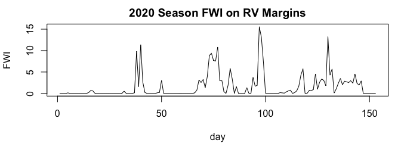
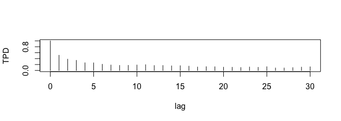

<!-- README.md is generated from README.Rmd. Please edit that file -->

# tpdmethods

<!-- badges: start -->

<!-- badges: end -->

The goal of tpdmethods is to make TPD-based methods accessible to more
researchers.

Recent work in multivariate extremes is built on the so-called tail
pairwise dependence (TPD). This summary metric of dependence in the
pairwise tail shares properties with covariance and this recent work has
used these properties to construct extremal analogues to classical
statistical tools including PCA and ARMA time series models. We
implement these extremal analysis pipelines in this R package
‘tpdmethods’. The package includes datasets and vignettes for
precipitation and fire weather analyses.

## Installation

You can install the development version of tpdmethods from
[GitHub](https://github.com/) with:

``` r
# install.packages("pak") # pak is a method to download packages from a variety of sources.
pak::pak("twixson/tpdmethods")
```

## Example 1: Time Series - Fire Weather

This is a basic example which shows a simple TLETS workflow. We will
perform a simplified version of the analysis in Wixson and Cooley
(2023). The scientific question is how much more likely is a fire season
like 2020 under present climate than under past climate. Wixson and
Cooley (2023) used Fire Weather Index (FWI) data to answer this
question. An example script and the original data can be found at
<https://github.com/twixson/seasonal_wildfire_risk_attribution>. The
data exhibited seasonality and so the authors performed a marginal
transformation that made the assumption of stationarity plausible and
put the FWI data on regularly varying ($\alpha = 2$) margins. This
marginally-transformed data lives in the package as
`fire_weather_present`, and `fire_weather_past`. Each dataset is a
matrix with 153 rows for the days in the fire season and 20 columns for
the years.

``` r
library(tpdmethods)
par(mar = c(4, 4, 2, 1) + 0.1)
plot(fire_weather_present[,15], 
     type = "l",
     main = "2020 Season FWI on RV Margins", 
     xlab = "day", 
     ylab = "FWI")
```



The first step is to estimate the TPD of the time series data. Since
these data have plausibly iid replicates (each season) and are already
on Fréchet($2$) margins we will use `matrix_as_seasons = TRUE` and
`trans_marginal = FALSE` in our `tpd()` call. We note that `max_lag`
matters because we are performing a time series analysis but other uses
of the package will ignore this.

``` r
fw_tpd_present <- tpd(fire_weather_present, 
                      max_lag = 30, 
                      trans_marginal = FALSE, 
                      matrix_as_seasons = TRUE)
#> [1] "Assuming this is a time series with 20 seasons."

plot(0:30, fw_tpd_present, 
     type = "h", 
     ylim = c(0, 1), 
     xlab = "lag", 
     ylab = "TPD")
```



After estimating the TPD we need to fit a model to the data. We will use
the extremes analogue to the innovations algorithm to fit a
transformed-linear moving average (TL-MA) model up to order `q = 20`. We
will visually compare the plot of the fitted TPD function to the
empirical TPD function to determine which model to retain.

``` r
set.seed(1982374)
model_coefs_present <- innovations(fw_tpd_present, max_q = 20)
fitted_model_tpdf <- maq_tpdf(model_coefs_present[[1]][15,], max_lag = 30)

par(mar = c(4, 4, 2, 1) + 0.1)
plot(0:30, fw_tpd_present, type = "h", ylim = c(0, 1), 
     main = "Present TPDFs", 
     xlab = "lag", 
     ylab = "TPD value")
lines(1:30 + 0.2, fitted_model_tpdf, 
      type = "h", col = "4")
legend("topright", legend = c("empirical", "MA(15)"), 
       text.col = c(1,4), bty = "n")
abline(h = 0.1, lty = 2, col = "grey")
```


Here we can see the TL-MA(15) model fits well up to lag-15. TL-MA(q)
models have non-zero TPDFs only up to lag-q just like classical MA(q)
models. Included on the plot is a horizontal dashed line at 0.1. This is
included because of the known bias in the TPD estimator. Wixson and
Cooley (2023) considered TPD values that were consistently around this
line to be that known bias and thus continued their analysis with the
TL-MA(15).

We could repeat the previous steps with the past-climate data (from
1958-1979) but will skip that for brevity.

In addition to these TPDF plots we will take a look at a summary
statistic to assess fit. We will consider the number of $k$-day runs
above a high  
quantile. In particular, we want to know the expected number of $k$-day
runs above the high quantile in a season.

``` r
q099 <- stats::quantile(fire_weather_present, probs = 0.99)

above_present <- apply(fire_weather_present, 2, function(x){
  above <- which(x > q099)
  run_lengths <- rle(diff(above))$lengths[rle(diff(above))$values == 1] + 1
  return_val <- c(sum(run_lengths >= 2),
                  sum(run_lengths >= 3), 
                  sum(run_lengths >= 5),
                  sum(run_lengths > 9))
})

rownames(above_present) <- c("2-day", "3-day", "5-day", "10-day")
present_confints <- apply(above_present, 1, function(x){
  count <- sum(x)
  out <- poisson.test(count, 20)
  return(c(out$estimate, out$conf.int))
})
rownames(present_confints) <- c("mean", "lower", "upper")
round(present_confints, 4)
#>        2-day  3-day  5-day 10-day
#> mean  0.3000 0.0500 0.0000 0.0000
#> lower 0.1101 0.0013 0.0000 0.0000
#> upper 0.6530 0.2786 0.1844 0.1844
```

We generate the confidence intervals using a Poisson distribution with
the primary goal of comparing to the intervals created this way from our
generated seasons.

Below we will generate 1000 seasons from the fitted model using
`gen_maq()`. Note that the marginal distribution is unknown so we
transform to Fréchet($2$) margins with `transform_marginal()` so that we
can compare to the observed RV FWI data.

``` r
set.seed(2389098)
temp_present <- gen_maq(n = 153*1000, 
                        thetas = model_coefs_present[[1]][15,1:15])
seasons_present <- 
  matrix(transform_marginal(temp_present, fix_gpd_params = TRUE, gpd_shape = 0.5), 
         ncol = 1000)
```

Now that we have generated 1000 seasons lets repeat the above exercise
and estimate expected number of runs of length $k$ in a season:

``` r
above_generated <- apply(seasons_present, 2, function(x){
  above <- which(x > q099)
  run_lengths <- rle(diff(above))$lengths[rle(diff(above))$values == 1] + 1
  return_val <- c(sum(run_lengths >= 2),
                  sum(run_lengths >= 3), 
                  sum(run_lengths >= 5),
                  sum(run_lengths > 9))
})
rownames(above_generated) <- c("2-day", "3-day", "5-day", "10-day")
generated_confints <- apply(above_generated, 1, function(x){
  count <- sum(x)
  out <- poisson.test(count, 1000)
  return(c(out$estimate, out$conf.int))
})
rownames(generated_confints) <- c("mean", "lower", "upper")
round(generated_confints, 4)
#>        2-day  3-day  5-day 10-day
#> mean  0.3630 0.1430 0.0520 0.0110
#> lower 0.3266 0.1205 0.0388 0.0055
#> upper 0.4023 0.1685 0.0682 0.0197
```

Note the broad agreement between our data and the fitted model.

This brief example demonstrated a few of the key functions:

- `tpd()` - for estimating the TPD function with replicated time series.
- `innovations()` - for fitting any order TL-MA(q) model based on the
  estimated TPD function.
- `maq_tpdf()` - for computing the model TPD function.
- `gen_maq()` - for generating observations from a TL-MA(q) process.
- `transform_marginal()` - for transforming the marginal distribution to
  be Fréchet($2$).

## Example 2: Principal Components Analysis - Financial Data

In this second breif example we will explore the extremes analogue to
principal components analysis using financial data from the Kenneth R.
French Data Library. These data are included in the package as
`financial_data`. The data consist of 13599 observations of losses from
30 financial sectors (e.g., coal, autos, and retail) from 1970 through
2023.

We begin by estimating the TPD matrix (TPDM):

``` r
tpdm <- tpd(as.matrix(financial_data[,-c(1)]))
#> [1] "Matrix input, we assume rows represent replicates"
#> [1] ". . . and columns represent variables."
```

The TPDM is an extremes analogue to the covariance matrix and it shares
many properties with a covariance matrix. In the following example we
have standardized the margins so the TPDM is analogous to a correlation
matrix. Now that the TPDM is estimated we need to perform the eigen
decomposition. The elements of the TPDM are estimated pairwise and thus
the estimated TPDM may not be positive definite. We fix this by
performing the eigen decomposition on a positive definite matrix that is
close to the estimated TPDM using the `make_pd = TRUE` toggle in the
`get_eigen()` call.

``` r
eigen_tpdm <- get_eigen(tpdm, make_pd = TRUE)
```

I NEED TO MAKE A FUNCTION THAT RETURNS THE EIGENPLOTS THAT DAN HAS IN
HIS FINANCIAL EXPLORATION.

``` r
fivenum(eigen_tpdm$vectors[,1])
#> [1] 0.1379751 0.1739027 0.1853870 0.1958264 0.2042286
fivenum(eigen_tpdm$vectors[,2])
#> [1] -0.39999359 -0.06395744  0.03315343  0.11228094  0.29537920
fivenum(eigen_tpdm$vectors[,3])
#> [1] -0.22866809 -0.12699828 -0.03387696  0.12182162  0.41570422
fivenum(eigen_tpdm$vectors[,4])
#> [1] -0.35077961 -0.11444792 -0.04861159  0.08740598  0.50443052
fivenum(eigen_tpdm$vectors[,5])
#> [1] -0.16996430 -0.09839706 -0.05095608  0.05488521  0.80497718
```
